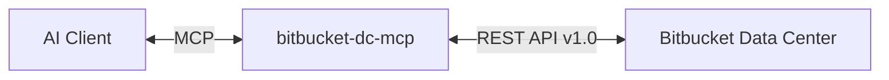

# Bitbucket DC MCP Server

<div align="center">

[](https://modelcontextprotocol.io)
[](https://www.typescriptlang.org/)
[](https://nodejs.org/)
[](LICENSE)

A [Model Context Protocol (MCP)](https://modelcontextprotocol.io) server that exposes **Bitbucket Data Center REST API v1.0** as tools for AI assistants.

</div>

## Overview

This server lets MCP-compatible clients (Claude Desktop, VS Code, IDEs, custom apps) interact with a Bitbucket Data Center instance — browsing projects, managing repositories, creating and reviewing pull requests, and more — through 48 tools.



## Prerequisites

- Node.js >= 20.11.0
- A Bitbucket Data Center instance with API access
- A personal access token or username/password credentials

## Quick Start

### Using npx (no install required)

```bash
BITBUCKET_URL=https://bitbucket.yourcompany.com \
BITBUCKET_TOKEN=your-token \
MCP_TRANSPORT=stdio \
npx bitbucket-dc-mcp
```

### From source

#### 1. Install dependencies

```bash
npm install
```

#### 2. Configure environment

Create a `.env` file (or export variables in your shell):

```env
# Required — your Bitbucket DC base URL
BITBUCKET_URL=https://bitbucket.yourcompany.com

# Authentication (choose one)
BITBUCKET_TOKEN=your-personal-access-token
# OR
BITBUCKET_USERNAME=your-username
BITBUCKET_PASSWORD=your-password

# Optional
BITBUCKET_DEFAULT_PROJECT=MYPROJ
BITBUCKET_ENABLE_DANGEROUS=false
MCP_TRANSPORT=http
PORT=3000
```

#### 3. Build and run

```bash
npm run build
node build/index.js
```

The server starts in HTTP mode by default at `http://localhost:3000/mcp`.

## Configuration

### Environment Variables

| Variable | Required | Description | Default |
|----------|----------|-------------|---------|
| `BITBUCKET_URL` | Yes | Bitbucket DC base URL (auto-appends `/rest/api/1.0`) | — |
| `BITBUCKET_TOKEN` | Yes* | Personal access token (Bearer auth) | — |
| `BITBUCKET_USERNAME` | Yes* | Username for basic auth | — |
| `BITBUCKET_PASSWORD` | Yes* | Password for basic auth | — |
| `BITBUCKET_DEFAULT_PROJECT` | No | Default project key for tools that accept `projectKey` | — |
| `BITBUCKET_ENABLE_DANGEROUS` | No | Enable destructive operations (`deletePRComment`, `deleteBranch`) | `false` |
| `MCP_TRANSPORT` | No | Transport mode: `stdio` or `http` | `http` |
| `PORT` | No | HTTP server port | `3000` |
| `CORS_ORIGIN` | No | CORS allowed origins | `*` |

\* Either `BITBUCKET_TOKEN` or both `BITBUCKET_USERNAME` + `BITBUCKET_PASSWORD` are required.

## Transport Modes

### HTTP Mode (Default)

Streamable HTTP transport for web deployments and remote access:

```bash
npm run serve:http
```

Endpoints:
- `GET /mcp` — SSE stream for server-initiated messages
- `POST /mcp` — JSON-RPC requests
- `DELETE /mcp` — Session termination
- `GET /health` — Health check

### Stdio Mode

Traditional stdio transport for local clients like Claude Desktop:

```bash
npm run serve:stdio
```

## Available Tools

### Projects (4 tools)
`listProjects` · `getProject` · `createProject` · `updateProject`

### Repositories (6 tools)
`listRepositories` · `getRepository` · `createRepository` · `forkRepository` · `getDefaultBranch` · `setDefaultBranch`

### Pull Requests (10 tools)
`listPullRequests` · `getPullRequest` · `createPullRequest` · `updatePullRequest` · `mergePullRequest` · `declinePullRequest` · `reopenPullRequest` · `approvePullRequest` · `unapprovePullRequest` · `canMergePullRequest`

### PR Comments (5 tools)
`listPRComments` · `addPRComment` · `getPRComment` · `updatePRComment` · `deletePRComment`

### PR Diff & Changes (4 tools)
`getPullRequestDiff` · `streamPullRequestDiff` · `getPullRequestPatch` · `getPullRequestChanges`

### PR Activity (3 tools)
`getPullRequestActivity` · `getPullRequestCommits` · `getPullRequestParticipants`

### PR Tasks (3 tools)
`listPRTasks` · `addBlockerComment` · `resolveTask`

### Branches & Tags (5 tools)
`listBranches` · `createBranch` · `deleteBranch` · `listTags` · `createTag`

### Commits (4 tools)
`listCommits` · `getCommit` · `getCommitChanges` · `getCommitDiff`

### Files (4 tools)
`browseFiles` · `getFileContent` · `editFile` · `listFiles`

## Client Integration

### VS Code / GitHub Copilot

Add to your **VS Code settings** (`settings.json`) or workspace `.vscode/mcp.json`:

```json
{
  "servers": {
    "bitbucket-dc-mcp": {
      "type": "stdio",
      "command": "npx",
      "args": ["-y", "bitbucket-dc-mcp"],
      "env": {
        "BITBUCKET_URL": "https://bitbucket.yourcompany.com",
        "BITBUCKET_TOKEN": "your-token",
        "MCP_TRANSPORT": "stdio"
      }
    }
  }
}
```

If using `settings.json` directly, nest it under `"mcp"`:

```jsonc
{
  "mcp": {
    "servers": {
      "bitbucket-dc-mcp": {
        "type": "stdio",
        "command": "npx",
        "args": ["-y", "bitbucket-dc-mcp"],
        "env": {
          "BITBUCKET_URL": "https://bitbucket.yourcompany.com",
          "BITBUCKET_TOKEN": "your-token",
          "MCP_TRANSPORT": "stdio"
        }
      }
    }
  }
}
```

### Claude Code

Add to your project's `.mcp.json`, or configure via the CLI:

```bash
claude mcp add bitbucket-dc-mcp \
  -e BITBUCKET_URL=https://bitbucket.yourcompany.com \
  -e BITBUCKET_TOKEN=your-token \
  -e MCP_TRANSPORT=stdio \
  -- npx -y bitbucket-dc-mcp
```

Or manually create/edit `.mcp.json` in your project root:

```json
{
  "mcpServers": {
    "bitbucket-dc-mcp": {
      "command": "npx",
      "args": ["-y", "bitbucket-dc-mcp"],
      "env": {
        "BITBUCKET_URL": "https://bitbucket.yourcompany.com",
        "BITBUCKET_TOKEN": "your-token",
        "MCP_TRANSPORT": "stdio"
      }
    }
  }
}
```

### Claude Desktop

Add to your Claude Desktop configuration (`claude_desktop_config.json`):

```json
{
  "mcpServers": {
    "bitbucket-dc-mcp": {
      "command": "npx",
      "args": ["-y", "bitbucket-dc-mcp"],
      "env": {
        "BITBUCKET_URL": "https://bitbucket.yourcompany.com",
        "BITBUCKET_TOKEN": "your-token",
        "MCP_TRANSPORT": "stdio"
      }
    }
  }
}
```

### Custom Clients

```typescript
import { Client } from "@modelcontextprotocol/sdk/client/index.js";
import { StdioClientTransport } from "@modelcontextprotocol/sdk/client/stdio.js";

const transport = new StdioClientTransport({
  command: "npx",
  args: ["-y", "bitbucket-dc-mcp"],
  env: {
    BITBUCKET_URL: "https://bitbucket.yourcompany.com",
    BITBUCKET_TOKEN: "your-token",
    MCP_TRANSPORT: "stdio",
  },
});

const client = new Client({ name: "my-client", version: "1.0.0" }, { capabilities: {} });
await client.connect(transport);

// List projects
const result = await client.callTool({ name: "listProjects", arguments: {} });
```

## Docker

### Build and run

```bash
docker compose up --build
```

The container runs in HTTP mode on port 3000 by default. Pass Bitbucket credentials via environment variables:

```bash
docker run -p 3000:3000 \
  -e BITBUCKET_URL="https://bitbucket.yourcompany.com" \
  -e BITBUCKET_TOKEN="your-token" \
  bitbucket-dc-mcp
```

### Development with Docker

```bash
docker compose --profile dev up mcp-server-starter-dev
```

Mounts source code for live reloading on port 3001.

## Development

### Commands

| Command | Description |
|---------|-------------|
| `npm run build` | Compile TypeScript to `build/` |
| `npm run typecheck` | Type-check without emitting |
| `npm run lint` | Run ESLint |
| `npm run lint:fix` | Auto-fix ESLint issues |
| `npm test` | Run all tests |
| `npm run test:watch` | Run tests in watch mode |
| `npm run inspect` | Build + launch MCP Inspector (stdio) |
| `npm run inspect:http` | MCP Inspector against HTTP endpoint |
| `npm run dev` | Build + interactive JSON-RPC REPL |
| `npm run knip` | Find unused exports/dependencies |
| `npm run gen:tool` | Generate a new tool module with test |

### Testing with MCP Inspector

```bash
# Stdio mode
npm run inspect

# HTTP mode (start server first, then in another terminal)
npm run inspect:http
```

The MCP Inspector provides an interactive UI to browse and test all registered tools.

### Adding a New Tool

1. Create `src/tools/my-domain.ts` (or add to an existing domain file)
2. Export a default `RegisterableModule` that registers tools in its `register()` function
3. The auto-loader discovers it automatically on next build
4. Or use the generator: `npm run gen:tool`

See existing files in `src/tools/` for examples.

## Architecture

```
src/
├── index.ts              # Entry point → boot()
├── server/boot.ts        # Config loading, client init, transport setup
├── lib/
│   ├── client.ts         # Singleton Axios client, path helpers
│   ├── config.ts         # Environment variable loading & validation
│   ├── pagination.ts     # Bitbucket DC pagination (start/limit/isLastPage)
│   └── errors.ts         # Error formatting, response helpers
├── registry/
│   ├── auto-loader.ts    # Discovers & registers modules from tools/resources/prompts
│   ├── module-processor.ts
│   ├── helpers.ts
│   └── types.ts          # RegisterableModule interface
└── tools/                # One file per domain, each registers multiple tools
    ├── projects.ts
    ├── repositories.ts
    ├── pull-requests.ts
    ├── pr-comments.ts
    ├── pr-diff.ts
    ├── pr-activity.ts
    ├── pr-tasks.ts
    ├── branches.ts
    ├── commits.ts
    └── files.ts
```

## Troubleshooting

| Issue | Solution |
|-------|----------|
| `BITBUCKET_URL is required` | Set the `BITBUCKET_URL` environment variable or add it to `.env` |
| `Cannot find module` errors | Run `npm run build` before starting the server |
| `401 Unauthorized` | Check your token or username/password credentials |
| `deleteBranch is disabled` | Set `BITBUCKET_ENABLE_DANGEROUS=true` to enable destructive operations |
| Tools not loading | Verify module has a valid default export matching `RegisterableModule` |

## License

MIT — see [LICENSE](LICENSE).

## Resources

- [Model Context Protocol Documentation](https://modelcontextprotocol.io)
- [Bitbucket Data Center REST API](https://developer.atlassian.com/server/bitbucket/rest/)
- [MCP Inspector](https://github.com/modelcontextprotocol/inspector)
